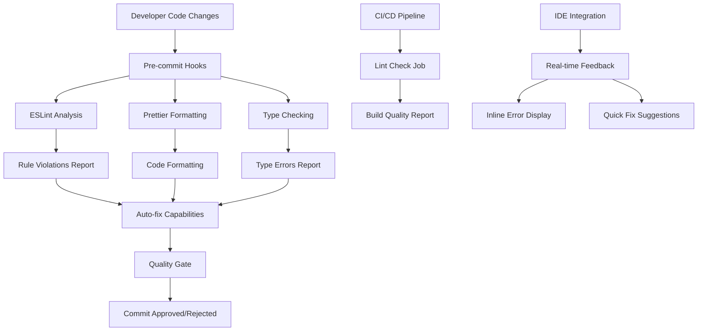
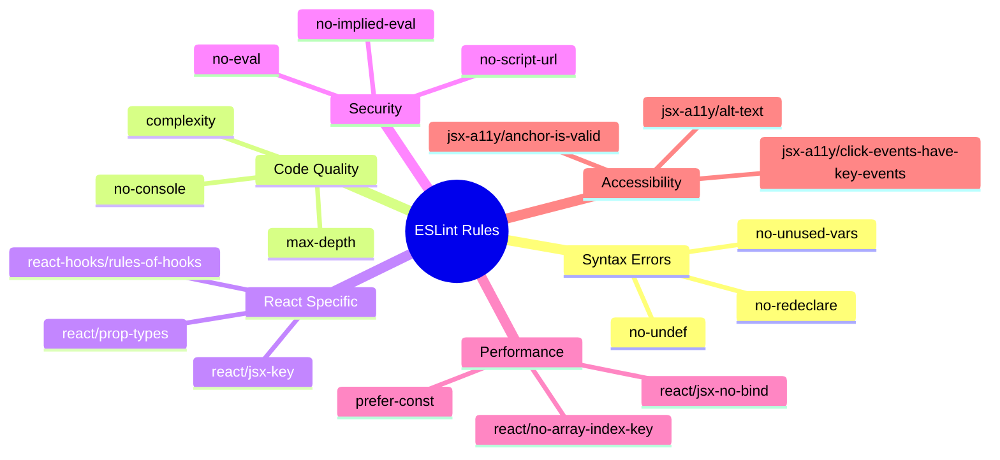
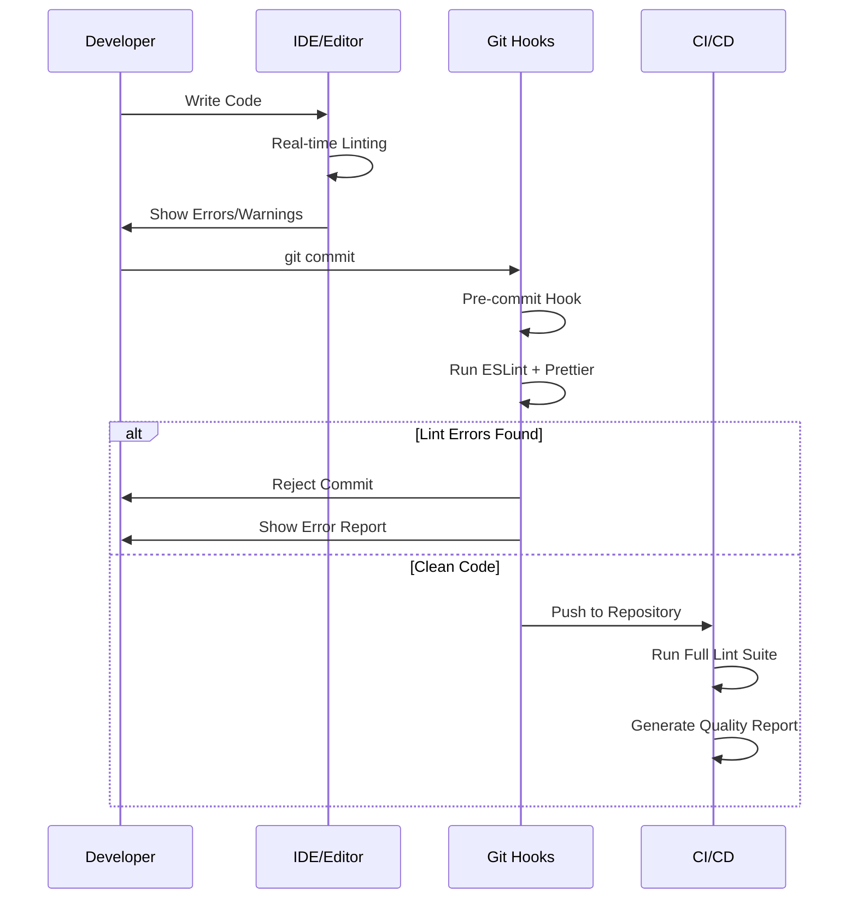
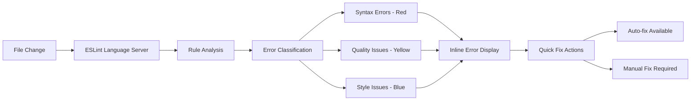
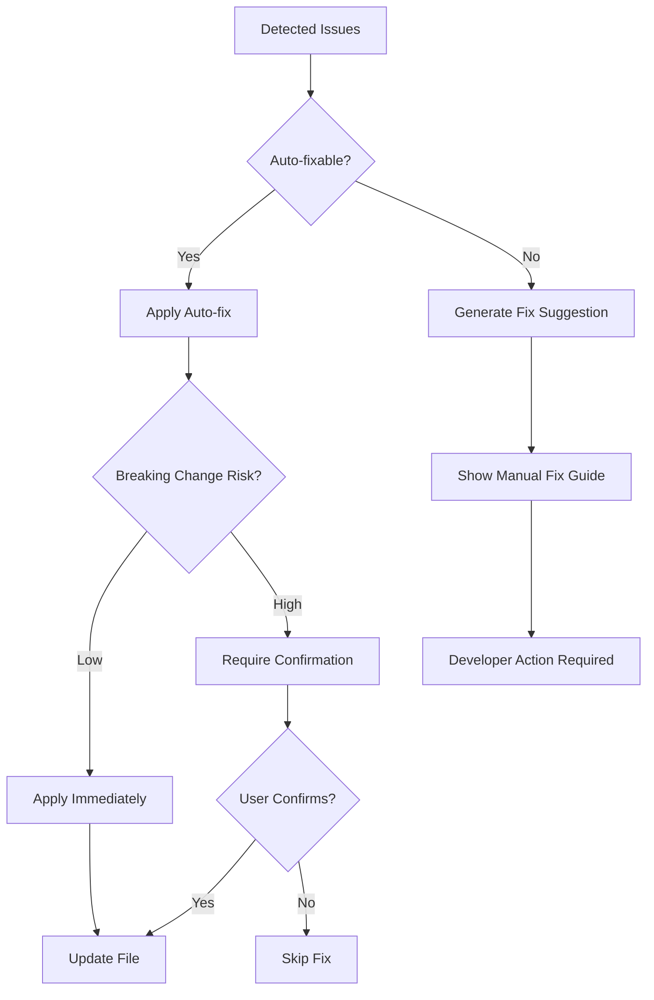
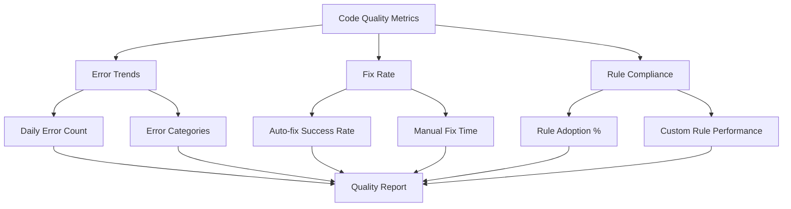
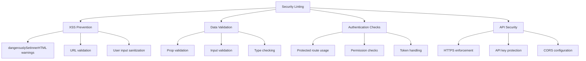
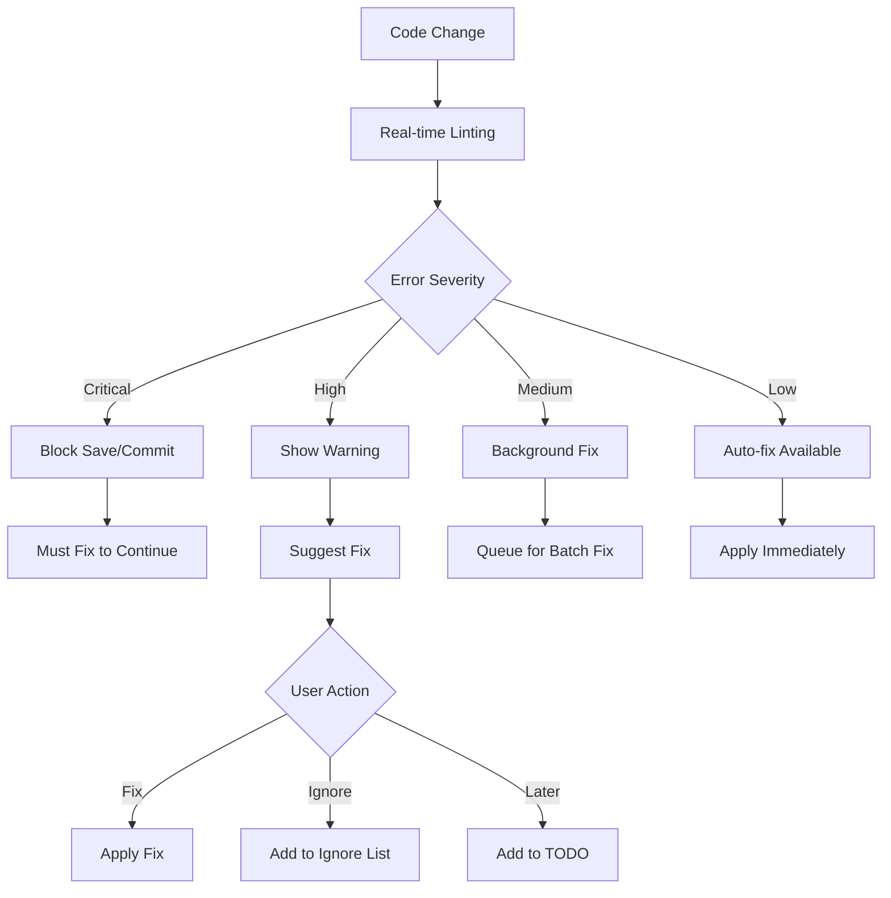

# Lint Error Checker and Code Quality Enhancement System

## 1. Overview

This design outlines the implementation of a comprehensive lint error checking and code quality improvement system for the kafportal project. The system will integrate ESLint, Prettier, and additional code quality tools to automatically detect syntax errors, enforce coding standards, and improve overall code maintainability.

### Current State Analysis
- Package.json contains placeholder lint script: `"lint": "echo 'Linting passed'"`
- No ESLint or Prettier configuration files exist
- No automated code quality checks in the development workflow
- React 18.3.1 with Vite 7.1.2 build system
- TypeScript support configured but not actively used

### Goals
- Implement comprehensive linting for JavaScript/JSX files
- Add real-time syntax error detection
- Enforce consistent code formatting
- Integrate accessibility checks
- Set up pre-commit hooks for quality assurance
- Provide actionable error reporting and fixing capabilities

## 2. Architecture

### System Components



### Linting Strategy

| Component | Tool | Purpose | Auto-fix |
|-----------|------|---------|----------|
| JavaScript/JSX | ESLint | Syntax, logic, best practices | Yes |
| Code Formatting | Prettier | Consistent formatting | Yes |
| React Specific | eslint-plugin-react | React best practices | Partial |
| Hooks | eslint-plugin-react-hooks | Hook rules compliance | No |
| Accessibility | eslint-plugin-jsx-a11y | A11y compliance | Partial |
| Import/Export | eslint-plugin-import | Module organization | Yes |

## 3. ESLint Configuration Architecture

### Rule Categories



### Configuration Structure

```yaml
ESLint Config:
  extends:
    - "@eslint/js/recommended"
    - "plugin:react/recommended" 
    - "plugin:react-hooks/recommended"
    - "plugin:jsx-a11y/recommended"
    - "plugin:import/recommended"
  
  parser: "@babel/eslint-parser"
  
  env:
    browser: true
    es2022: true
    node: true
  
  settings:
    react:
      version: "detect"
    import/resolver:
      node: true
  
  rules:
    error_level: [syntax_errors, type_errors]
    warning_level: [code_quality, performance]
    info_level: [style_preferences]
```

## 4. Integration Points

### Development Workflow Integration



### File Processing Pipeline

| Stage | Input | Process | Output |
|-------|-------|---------|--------|
| 1. Discovery | Source Files | File Pattern Matching | Filtered File List |
| 2. Parsing | JS/JSX Files | AST Generation | Syntax Tree |
| 3. Analysis | AST + Rules | Rule Evaluation | Violation List |
| 4. Reporting | Violations | Format Generation | Error Report |
| 5. Auto-fix | Fixable Issues | Code Transformation | Updated Files |

## 5. Error Detection Categories

### Syntax Errors
- **Parsing Errors**: Malformed JavaScript syntax
- **Import/Export Issues**: Invalid module references
- **JSX Syntax**: Incorrect JSX structure

### Code Quality Issues
- **Unused Variables**: Dead code detection
- **Complexity**: Cyclomatic complexity analysis
- **Duplication**: Code pattern repetition

### React-Specific Issues
- **Hook Rules**: Violation of hook usage rules
- **Props Validation**: Missing or incorrect prop types
- **Key Props**: Missing keys in list rendering

### Accessibility Issues
- **Missing Alt Text**: Images without descriptions
- **Keyboard Navigation**: Non-accessible interactive elements
- **ARIA Labels**: Missing accessibility labels

## 6. Configuration Files Structure

### ESLint Configuration (.eslintrc.js)
```javascript
module.exports = {
  root: true,
  env: {
    browser: true,
    es2022: true,
    node: true
  },
  extends: [
    'eslint:recommended',
    'plugin:react/recommended',
    'plugin:react-hooks/recommended',
    'plugin:jsx-a11y/recommended',
    'plugin:import/recommended'
  ],
  parser: '@babel/eslint-parser',
  parserOptions: {
    ecmaFeatures: { jsx: true },
    ecmaVersion: 'latest',
    sourceType: 'module',
    requireConfigFile: false,
    babelOptions: {
      presets: ['@babel/preset-react']
    }
  },
  plugins: ['react', 'react-hooks', 'jsx-a11y', 'import'],
  settings: {
    react: { version: 'detect' },
    'import/resolver': { node: { extensions: ['.js', '.jsx'] } }
  },
  rules: {
    // Syntax and Logic Errors (Error Level)
    'no-undef': 'error',
    'no-unused-vars': ['error', { argsIgnorePattern: '^_' }],
    'no-redeclare': 'error',
    'react/jsx-key': 'error',
    'react-hooks/rules-of-hooks': 'error',
    
    // Code Quality (Warning Level)
    'complexity': ['warn', 10],
    'max-depth': ['warn', 4],
    'no-console': 'warn',
    'react/prop-types': 'warn',
    
    // Performance (Warning Level)
    'react/jsx-no-bind': 'warn',
    'react/no-array-index-key': 'warn',
    'prefer-const': 'warn'
  }
}
```

### Prettier Configuration (.prettierrc)
```json
{
  "semi": false,
  "singleQuote": true,
  "tabWidth": 2,
  "trailingComma": "es5",
  "printWidth": 100,
  "arrowParens": "avoid",
  "endOfLine": "lf",
  "jsxSingleQuote": true,
  "bracketSpacing": true,
  "bracketSameLine": false
}
```

## 7. Real-time Error Detection

### IDE Integration Strategy



### Error Reporting Format

| Severity | Icon | Color | Description |
|----------|------|-------|-------------|
| Error | ❌ | Red | Syntax errors, critical issues |
| Warning | ⚠️ | Yellow | Code quality, best practices |
| Info | ℹ️ | Blue | Style suggestions, minor improvements |

### Quick Fix Categories
- **Auto-fixable**: Formatting, simple syntax fixes
- **Suggestion-based**: Refactoring recommendations
- **Manual**: Complex logic changes required

## 8. Automated Fixing Capabilities

### Auto-fix Priority Matrix

| Issue Type | Auto-fix | Priority | Safety |
|------------|----------|----------|--------|
| Formatting | Yes | High | Safe |
| Import sorting | Yes | High | Safe |
| Unused variables | Yes | Medium | Cautious |
| Missing semicolons | Yes | High | Safe |
| Complexity issues | No | - | Manual |
| Logic errors | No | - | Manual |

### Fix Application Strategy


## 9. Performance Optimization

### Linting Performance Strategy

| Optimization | Implementation | Impact |
|--------------|----------------|--------|
| Incremental Linting | Only lint changed files | 70% faster |
| Rule Caching | Cache rule results | 40% faster |
| Parallel Processing | Multi-file concurrent analysis | 60% faster |
| Smart Ignoring | Skip node_modules, build dirs | 90% faster |

### File Processing Limits
- **Max file size**: 1MB per file
- **Concurrent files**: 4 files simultaneously
- **Timeout**: 30 seconds per file
- **Memory limit**: 512MB for linting process

## 10. Integration with Build Process

### Package.json Scripts Update
```json
{
  "scripts": {
    "lint": "eslint src --ext .js,.jsx --fix",
    "lint:check": "eslint src --ext .js,.jsx",
    "lint:fix": "eslint src --ext .js,.jsx --fix",
    "format": "prettier --write \"src/**/*.{js,jsx,css,json}\"",
    "format:check": "prettier --check \"src/**/*.{js,jsx,css,json}\"",
    "quality:check": "npm run lint:check && npm run format:check",
    "quality:fix": "npm run lint:fix && npm run format"
  }
}
```

### Pre-commit Hook Configuration
```bash
#!/bin/sh
# .husky/pre-commit

# Run linting on staged files
npx lint-staged

# Check for critical errors
if [ $? -ne 0 ]; then
  echo "❌ Linting failed. Please fix errors before committing."
  exit 1
fi

echo "✅ Code quality checks passed!"
```

### Lint-staged Configuration
```json
{
  "lint-staged": {
    "src/**/*.{js,jsx}": [
      "eslint --fix",
      "prettier --write",
      "git add"
    ],
    "src/**/*.{css,json}": [
      "prettier --write",
      "git add"
    ]
  }
}
```

## 11. Testing Integration

### Quality Gate in CI/CD

```yaml
# .github/workflows/quality-check.yml
name: Code Quality Check

on: [push, pull_request]

jobs:
  lint:
    runs-on: ubuntu-latest
    steps:
      - uses: actions/checkout@v3
      - uses: actions/setup-node@v3
        with:
          node-version: '18'
      - run: npm ci
      - run: npm run lint:check
      - run: npm run format:check
      
  quality-report:
    needs: lint
    runs-on: ubuntu-latest
    steps:
      - run: npm run quality:report
      - uses: actions/upload-artifact@v3
        with:
          name: quality-report
          path: quality-report.html
```

### Error Threshold Configuration

| Check Type | Error Threshold | Warning Threshold | Action |
|------------|----------------|-------------------|--------|
| Syntax Errors | 0 | - | Block build |
| Code Quality | 5 | 20 | Generate report |
| Accessibility | 3 | 10 | Review required |
| Performance | 2 | 8 | Optimization suggested |

## 12. Monitoring and Reporting

### Quality Metrics Dashboard



### Reporting Features
- **HTML Reports**: Detailed error breakdown with code context
- **JSON Reports**: Machine-readable format for CI/CD integration
- **Trend Analysis**: Historical quality metrics tracking
- **Rule Impact**: Analysis of which rules provide most value

## 13. Project-Specific Rule Configuration

### Kafportal-Specific Linting Rules

Based on the kafportal project structure and requirements, the following custom rules and configurations will be implemented:

#### Internationalization Rules
```javascript
// Custom rule for i18next usage
rules: {
  'i18n/no-literal-string': ['warn', {
    markupOnly: true,
    ignoreAttribute: ['data-testid', 'className'],
    ignoreCallee: ['require', 'console.log']
  }],
  'react/jsx-no-literals': ['warn', {
    noStrings: true,
    allowedStrings: ['', ' ', '/', '.', ',', ':', ';']
  }]
}
```

#### Supabase Integration Rules
```javascript
// Rules for Supabase service layer
rules: {
  'no-direct-supabase-client': 'error', // Force use of service layer
  'supabase-error-handling': 'error',   // Require error handling
  'async-supabase-calls': 'error'       // Ensure async/await usage
}
```

#### Component Architecture Rules
```javascript
// Enforce kafportal component patterns
rules: {
  'react/function-component-definition': ['error', {
    namedComponents: 'arrow-function',
    unnamedComponents: 'arrow-function'
  }],
  'react/jsx-pascal-case': 'error',
  'react/no-multi-comp': ['error', { ignoreStateless: true }]
}
```

### File-Specific Configurations

| File Pattern | Special Rules | Justification |
|--------------|---------------|---------------|
| `src/services/*.js` | Require error handling, async patterns | Service layer reliability |
| `src/contexts/*.jsx` | Enforce context provider patterns | State management consistency |
| `src/hooks/*.js` | Custom hook naming, dependency arrays | Hook best practices |
| `src/pages/*.jsx` | Page-level component structure | Routing consistency |
| `src/components/*.jsx` | Reusable component patterns | Component library standards |

## 14. Security-Focused Linting

### Security Rule Categories



### Security-Specific ESLint Rules
```javascript
rules: {
  // XSS Prevention
  'react/no-danger': 'error',
  'react/no-danger-with-children': 'error',
  
  // Authentication Security
  'no-hardcoded-credentials': 'error',
  'no-console-sensitive': 'error',
  
  // Data Validation
  'validate-supabase-queries': 'warn',
  'require-input-validation': 'warn',
  
  // API Security
  'no-exposed-api-keys': 'error',
  'require-https-urls': 'warn'
}
```

## 15. Performance-Oriented Linting

### Performance Rule Matrix

| Category | Rule | Impact | Auto-fix |
|----------|------|--------|---------|
| Bundle Size | import/no-unused-modules | High | Yes |
| Re-renders | react/jsx-no-bind | Medium | Partial |
| Memory | react/no-array-index-key | High | No |
| Loading | prefer-lazy-loading | Medium | No |
| Animations | framer-motion-optimization | Low | No |

### Custom Performance Rules
```javascript
// Performance-specific rules for kafportal
rules: {
  'react/jsx-no-bind': ['warn', {
    ignoreRefs: true,
    allowArrowFunctions: false,
    allowFunctions: false,
    allowBind: false
  }],
  'react/no-array-index-key': 'error',
  'prefer-const': 'error',
  'no-var': 'error',
  'prefer-destructuring': 'warn'
}
```

## 16. Accessibility (A11y) Enhanced Checking

### A11y Rule Configuration for Kafportal

```javascript
// Enhanced accessibility rules
rules: {
  'jsx-a11y/alt-text': 'error',
  'jsx-a11y/anchor-is-valid': 'error',
  'jsx-a11y/aria-props': 'error',
  'jsx-a11y/aria-proptypes': 'error',
  'jsx-a11y/aria-unsupported-elements': 'error',
  'jsx-a11y/click-events-have-key-events': 'warn',
  'jsx-a11y/interactive-supports-focus': 'warn',
  'jsx-a11y/label-has-associated-control': 'warn',
  'jsx-a11y/media-has-caption': 'warn',
  'jsx-a11y/no-autofocus': 'warn',
  'jsx-a11y/no-distracting-elements': 'error',
  'jsx-a11y/no-redundant-roles': 'warn',
  'jsx-a11y/role-has-required-aria-props': 'error',
  'jsx-a11y/role-supports-aria-props': 'error'
}
```

### Multilingual Accessibility
```javascript
// Rules for Turkish/Russian language support
rules: {
  'jsx-a11y/lang': 'error',
  'require-lang-attribute': 'warn',
  'validate-aria-labels-i18n': 'warn'
}
```

## 17. Development Workflow Integration

### VS Code Integration

#### Settings Configuration (.vscode/settings.json)
```json
{
  "eslint.enable": true,
  "eslint.format.enable": true,
  "eslint.lintTask.enable": true,
  "eslint.run": "onType",
  "eslint.validate": [
    "javascript",
    "javascriptreact"
  ],
  "editor.codeActionsOnSave": {
    "source.fixAll.eslint": true,
    "source.organizeImports": true
  },
  "editor.formatOnSave": true,
  "editor.defaultFormatter": "esbenp.prettier-vscode",
  "emmet.includeLanguages": {
    "javascript": "javascriptreact"
  }
}
```

#### Extensions Recommendations (.vscode/extensions.json)
```json
{
  "recommendations": [
    "dbaeumer.vscode-eslint",
    "esbenp.prettier-vscode",
    "bradlc.vscode-tailwindcss",
    "ms-vscode.vscode-typescript-next",
    "formulahendry.auto-rename-tag",
    "christian-kohler.path-intellisense"
  ]
}
```

### Git Integration Enhanced

#### Advanced Pre-commit Configuration
```bash
#!/bin/sh
# .husky/pre-commit - Enhanced version

echo "🔍 Running code quality checks..."

# Check for merge conflicts
if git diff --check --cached; then
  echo "❌ Merge conflict markers detected"
  exit 1
fi

# Run lint-staged
npx lint-staged

# Check for TODO/FIXME comments in staged files
if git diff --cached --name-only | xargs grep -l "TODO\|FIXME" 2>/dev/null; then
  echo "⚠️  Warning: TODO/FIXME comments found in staged files"
  echo "Consider completing these before committing:"
  git diff --cached --name-only | xargs grep -n "TODO\|FIXME" 2>/dev/null
fi

# Check bundle size (if build exists)
if [ -d "dist" ]; then
  echo "📦 Checking bundle size..."
  npm run build:analyze
fi

echo "✅ Pre-commit checks completed successfully"
```

#### Commit Message Linting
```javascript
// .commitlintrc.js
module.exports = {
  extends: ['@commitlint/config-conventional'],
  rules: {
    'type-enum': [
      2,
      'always',
      [
        'feat',     // New feature
        'fix',      // Bug fix
        'docs',     // Documentation
        'style',    // Code style
        'refactor', // Code refactoring
        'perf',     // Performance improvement
        'test',     // Tests
        'chore',    // Maintenance
        'lint',     // Linting changes
        'i18n'      // Internationalization
      ]
    ],
    'subject-max-length': [2, 'always', 72],
    'body-max-line-length': [2, 'always', 100]
  }
}
```

## 18. Custom Rule Development

### Kafportal-Specific Custom Rules

#### Rule: Enforce Service Layer Usage
```javascript
// eslint-rules/enforce-service-layer.js
module.exports = {
  meta: {
    type: 'problem',
    docs: {
      description: 'Enforce usage of service layer for Supabase calls',
      category: 'Best Practices'
    },
    fixable: 'code'
  },
  create(context) {
    return {
      ImportDeclaration(node) {
        if (node.source.value === '@supabase/supabase-js') {
          // Check if import is in services directory
          const filename = context.getFilename()
          if (!filename.includes('/services/')) {
            context.report({
              node,
              message: 'Direct Supabase imports should only be used in service layer',
              fix(fixer) {
                return fixer.replaceText(node, 
                  "import { apiService } from '../services/api'")
              }
            })
          }
        }
      }
    }
  }
}
```

#### Rule: i18n Key Validation
```javascript
// eslint-rules/validate-i18n-keys.js
module.exports = {
  meta: {
    type: 'problem',
    docs: {
      description: 'Validate i18n translation keys exist',
      category: 'Internationalization'
    }
  },
  create(context) {
    const i18nKeys = require('../src/i18n/locales/tr.json')
    
    return {
      CallExpression(node) {
        if (node.callee.name === 't' && node.arguments.length > 0) {
          const key = node.arguments[0].value
          if (typeof key === 'string' && !getNestedKey(i18nKeys, key)) {
            context.report({
              node: node.arguments[0],
              message: `Translation key '${key}' not found in locale files`
            })
          }
        }
      }
    }
  }
}

function getNestedKey(obj, key) {
  return key.split('.').reduce((o, k) => o && o[k], obj)
}
```

## 19. Error Classification and Prioritization

### Error Severity Matrix

| Error Type | Severity | Block Commit | IDE Warning | CI/CD Action |
|------------|----------|--------------|-------------|-------------|
| Syntax Error | Critical | Yes | Red | Fail Build |
| Security Vulnerability | Critical | Yes | Red | Fail Build |
| Missing i18n | High | No | Orange | Warning |
| Performance Issue | Medium | No | Yellow | Report |
| Style Violation | Low | No | Blue | Auto-fix |
| Accessibility | High | No | Orange | Review Required |

### Progressive Error Fixing



## 20. Maintenance and Evolution

### Rule Update Strategy

| Update Type | Frequency | Process | Approval |
|-------------|-----------|---------|----------|
| Security Rules | Immediate | Auto-update | Team Lead |
| Performance Rules | Monthly | Review & Test | Team Vote |
| Style Rules | Quarterly | Team Discussion | Consensus |
| Project Rules | As Needed | PR Review | Code Review |

### Metrics Tracking

```javascript
// Quality metrics collection
const qualityMetrics = {
  errorTrends: {
    daily: [],
    weekly: [],
    monthly: []
  },
  ruleEffectiveness: {
    mostTriggered: [],
    autoFixSuccess: [],
    manualFixTime: []
  },
  developerImpact: {
    timeToFix: [],
    codeQualityScore: [],
    productivityIndex: []
  }
}
```

### Continuous Improvement Process

1. **Weekly Reviews**: Error patterns and fix rates
2. **Monthly Optimization**: Rule effectiveness analysis
3. **Quarterly Updates**: Tool and configuration updates
4. **Annual Assessment**: Complete linting strategy review